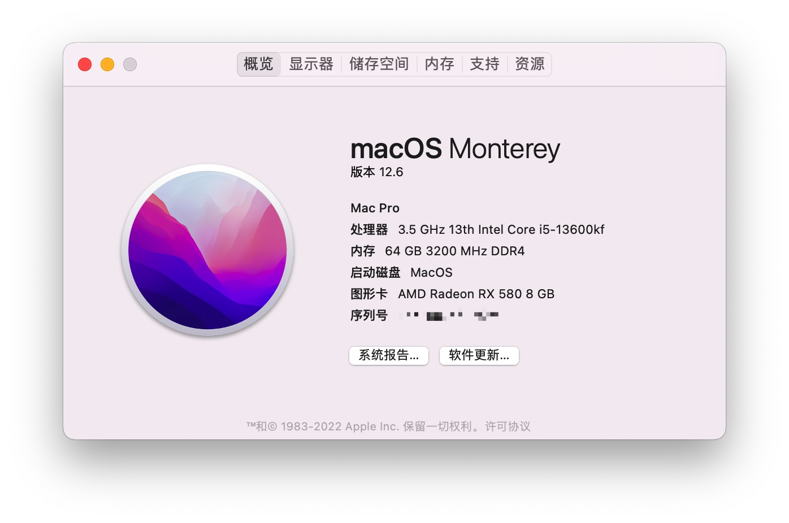

# 13600KF 黑苹果

> 切记在使用前更换三码

## 硬件配置

| 名称 | 型号 |
|:-:|:-:|
| CPU | Intel 13600KF盒装 |
| 主板 | 尔英B760M |
| 内存 | 酷兽3200 32G * 2 |
| 固态 | 酷兽1TB SSD |
| 显卡 | 588满血版 |
| 散热器 | 酷里奥倚天p60t性能版 |
| 电源 | 酷冷至尊GX650 |
| 机箱 | 玩嘉孤勇者mini黑无立柱 |

## 黑苹果展示

### 关于本机

### CPU 

#### GeekBench5

#### GeekBench6

### 显卡

### 板载2.5G网卡

### 声卡

### 传感器

> 这里风扇识别有点问题，我只有一个风扇，但是识别出来了5个

